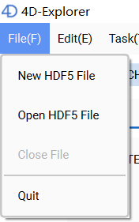
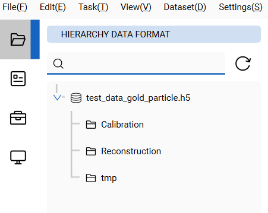
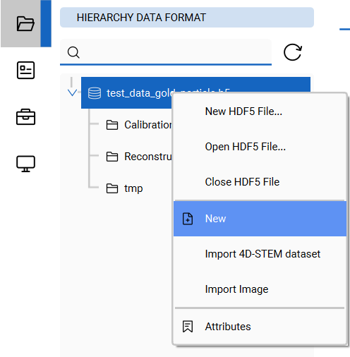
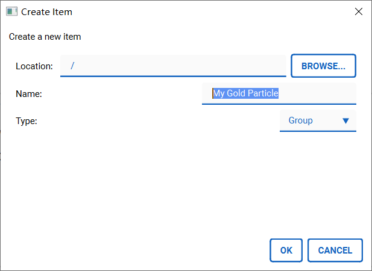

Usage Guide
===========

Data manipulation
-----------------

4D-Explorer is based on [HDF5](https://www.hdfgroup.org/solutions/hdf5). To create a new HDF5 file, find the 'File' menu, and click the 'New HDF5 File' option. Then, click 'Open HDF5 File' to open the created file before.

There are three groups initialized:

- Calibration
- Reconstruction
- temp

which is shown on the 'File' page of the left control panel. In an HDF5 file, groups are like folders or directories, and datasets are like files, and they are editable just like what we do in our operating system. All of the groups and datasets in the HDF5 file will be displayed here.

Right-click one of these groups and open a context menu. There are options available for this group, including:

- 'New' to create a subgroup or a dataset
- 'Import 4D-STEM dataset' to import a 4D-STEM dataset into this group.
- 'Move/Copy/Rename/Delete' Edit this group.
- 'Attributes' view the attributes of this group.

You can also create, move, copy, rename or delete these groups as you like, just note that undo may be NOT available.

> Be careful when you delete something.